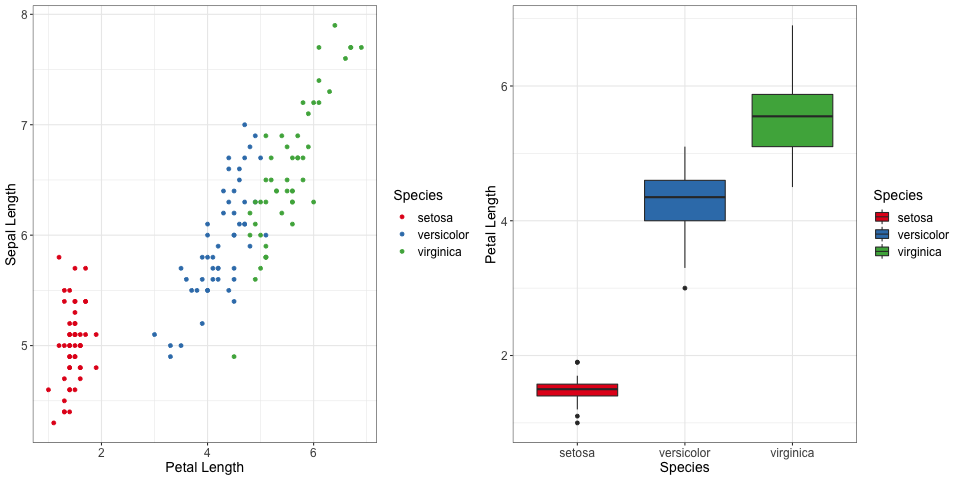
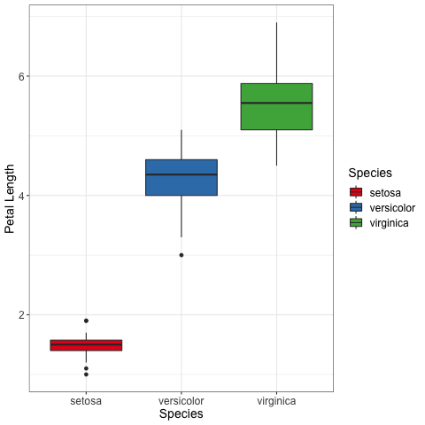

# data-viz
This repo will eventually be a ressource for good data-viz techniques and tips in R.

 THIS REPOSITORY IS STILL A WORK IN PROGRESS

## Currently planned :
- data viz principles (how to choose the type of graph, axis labelled, proportionnality of ink, one plot per idea, etc ...)
- ggplot2 basic explanations
- Colors (colorblind, emotions associated to colors)
- Classic pitfalls (p-value and error bars in multiple testing)
- Dimensionality reduction for data viz (Link to the general DimRed repo ?)

## Planned structure of the repo :
- `scripts/` contain the scripts used to plot everything
- `plots/` contain the differents plots that will eventually be used in that README (or on the website ?) as examples
- `data/` might eventually contains a dataset for which we do a bit of example, otehrwise we will just use the iris dataset.

-----
# Introduction
Visually representing data is necessary to summarise the data in a way a human brain can understand. However there are multiples way to do it, and a lot of ways to do it horribly wrong. In this article (TODO ?) we will go over some important principles in data visualisation, some good practices and the pitfalls to avoid in order to make the best graphs possible.

------
# What do you want to show, and how to do it
As examples, we will use the classic "iris" dataset, which is present in the R "datasets" library

## Know what you are trying to communicate.
The first question you have to ask when you are winding up to make a graph, is what you are trying to communicate with said graphs. If we want to compare the length of petals between species, the two following graphs do contain the desired information. But which one of those is the best ?

The graph on the left does contain all of the information about Species and Petal Length, but it also contains information about Sepal length, which is, in this example, irrelevant to the comparison between species. The boxplot on the right contains strictly less information but it contains the information necessary for the comparison, and not much more.

It is best, when possible to use only one plot per idea. Plots that can carry multiple ideas exists, but they are best used when summarising results that have already been presented or when exploring the dataset.

## Choose your type of graph
The type of graph you choose contains information as well. By using a boxplot, you are making the choice to only show some informations but not the full distribution, this choice is meaningfull and carries implication. It is thus very important to choose carefully what type of plot you are using and which assumptions it carries.

We will have a whole part describing various types of plots and what they communicate, (TODO : link)

## Make your graphs clear
Let's go back to our previous boxplot

It is very important, and harder than you might expect, to take a step back and look at what information is *actually* present on the plot, and not what you assume is here.

This plot for example has no title, and in itslef does not mention where the data is from, a title, or subtext might be usefull to make sure the reader is not lost. But there are other things you might have missed...

Here's a fun question : what are all of the informations in each boxplot ?

- The bar at the middle of a box is the median
- The sides of the box show the first and third quartiles of the repartition
- The outliers, but how are they declared outliers ?
- The whiskers however are not the last deciles, as you might have expected.

Indeed this graph has been made via ggplot2, and more precisely with the `geom_boxplot` function, whose manual reads

> The upper whisker extends from the hinge to the largest value no further than 1.5 * IQR from the hinge (where IQR is the inter-quartile range, or distance between the first and third quartiles). The lower whisker extends from the hinge to the smallest value at most 1.5 * IQR of the hinge

I would be willing to bet that this definition what not what you had in mind. Because of that, it is vital when presenting a plot to let a way for the reader to know this kind of details. It can be put into the legend of your plot, or it can be by making your code generating your plots easilly accessible and understandible.

------
# Introduction to ggplot2
This article is meant to be very general, but if you wish to see the coding aspect of it, we will be using ggplot2 in R to plot every examples. This part can serve as an introduction to the package main advantages and inner working, but is completely skippable if you are looking for a more general overview of how to design your plots.

The scripts used to generate each plots can be found in `scripts/`

## data and aesthetic
Each

## functions

## themes

-------
# Different types of graph

## Scatterplot
geom_point(), geom_count(), geom_dot() ?, geom_rugplot()

## 2DDensity plots and heatmaps
geom_bin_2d(), geom_tile(), geom_contour(), geom_countour_filled(), geom_hex()

## Density plots and histograms
geom_density(), geom_freqpoly() ?, geom_histogram()

## boxplots
geom_boxplot(), geom_quantile()

## violinplots
geom_violin()

## lineplots
geom_function(), geom_line(), geom_path(), geom_step(), geom_ribbon(), geom_smooth()

## barplots
geom_bar(), geom_col()

## Others
geom_qq_line

--------
# Vocabulary
- Overplotting
- Error bars
