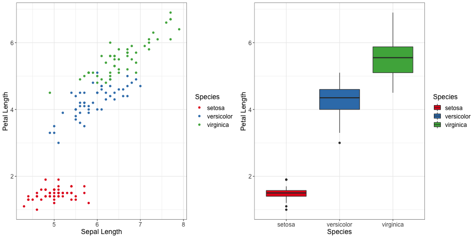
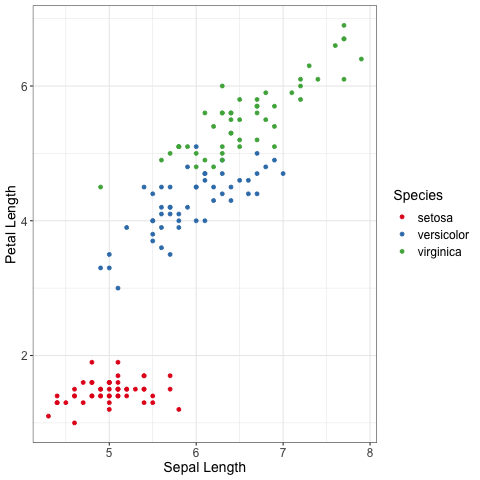
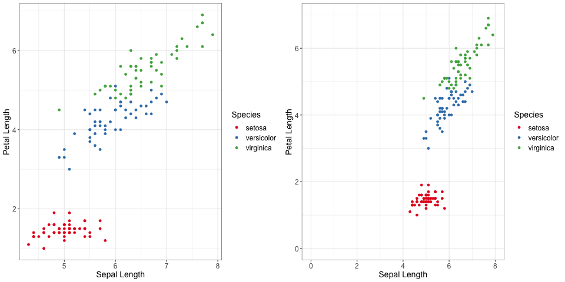
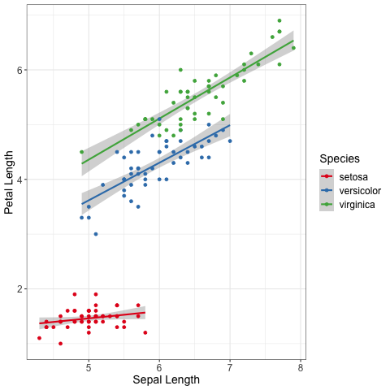
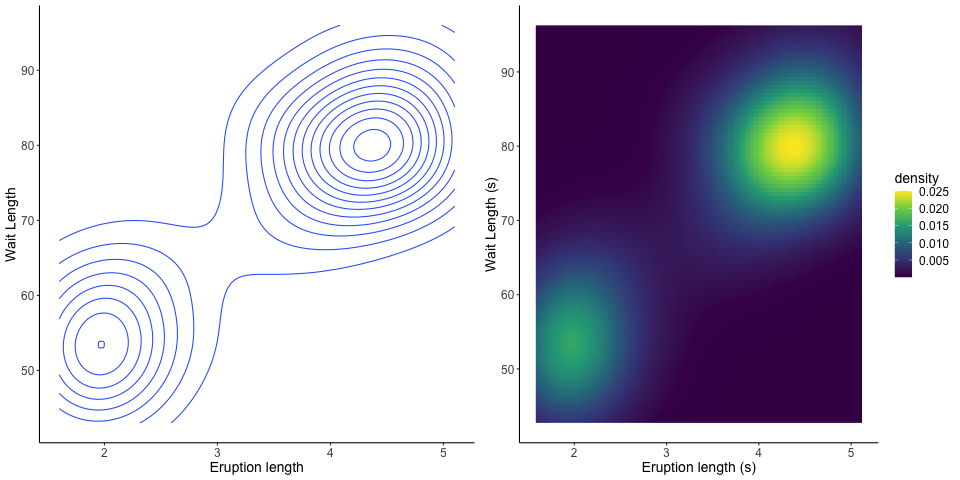

# data-viz for researchers

# Introduction
Visually representing data is necessary to summarise the data in a way a human brain can understand. However there are multiples way to do it, and a lot of ways to do it horribly wrong. In this repository, we will go over some important principles in data visualisation, some good practices and the pitfalls to avoid in order to make the best graphs possible.
Most plots will be made using R and ggplot2, an introduction to ggplot2 as well as a good librairy of examples will be present as well.

## Structure of the repository :
- `scripts/` contain the various scripts used to create the plots you will see in this page
- `plots/` contain the differents plots that will eventually be used in that README as examples
- `data/` will contain a few toy datasets to illustrate our points. Larger datasets might be downloaded in this location for plots that necessitates a high number of observations (i.e. heatmaps)
- `presentation/` contains every important document for the creation of a presentation on the subject, as well as the pdf documents used in a presentation given on the subject in the context of iPOP-UP's bioinformatic meetings.

## R version and librairies
You will find in this repositery the file TODO which contains the necessary information to create a conda environment containing all the necessary tools to run the scripts present here.

To create the corresponding environment on your local machine, please run
TODO

To activate it please run
TODO

------
# Know what you are trying to communicate and chose the appropriate type of graph

## Know what you are trying to communicate.
The first question to ask yourself before doing anything, is know what exactly it is that you are trying to communicate. Do you want to show how to continuous measures are linked ? Or do you want to compare the value of a measure accross two groups ?

For example, let's imagine you wish to compare the length of petals between different species of plants.

The graph on the left does contain all of the information about Species and Petal Length, but it also contains information about Sepal length, which is irrelevant to the comparison of petal length between species. The boxplot on the right contains strictly less information but it contains the information necessary for the comparison, and not much more.

It is best, when possible to limit the information in the plots to the strict minimum allowing to carry your message. And as a consequence, it is better when possible to limit yourself to one idea per plot. Figures that carry several ideas at once do exist and get published, but they also run the risk of confusing the reader, either by them not understanding what you mean, or worse, by understanding something false.

## Choose your type of graph

Now that you know what you want to represent, you must choose how you are going to represent it. There is no "one size fits all" answer here, but each type of graphs have their specific strength, and their own sets of assumptions, so let's list the most popular types of graphs.

### Scatterplot

A scatterplot is a good way to represent the dependencie between two *numerical continuous* variables accross several samples. You can also use colors to illustrate how this relationship depends from another *categorical* variable.

Scatterplots tend to become difficult to read if you've got too many observations, of if you add too many colors to it. If you've got too many informations, consider using a heatmap or 2D density plot.

By default, and in a lot of cases, the 2 axis will not be of the same scale and will not include the 0 value. Whereas it is appropriate to check the relationship between the 2 numerical continuous variable, it can make them easy to misinterpret if those elements are not taken into account.

See below, a side by side comparion between the "default" look, and one including 0, and see the difference in feels it can create.

This type of plot is often can be used to illustrate linear models.

### 2D density plots
2D density plots function similarly to scatterplot, in that they represent the dependencies between two *numerical continuous*, but they are best prefered in the case of a high number of observations.

This type of graph is not limited in the number of observations in can show.

Less precise then scatterplots, as the individual points are not visible. The way data is summarised can vary depending on the exact method you are using

There exists a lot of ways to realise a 2D density plots, you can see here several of them. But what you choose to represent with the colors (i.e. density, counts, etc...) can drasticly change the look of the final figure.

2D density plots are sometime called "heatmap" as well.

### Categorical heatmaps
Categorical heatmaps are a way to reprensent a numerical variable value in fucntion of two other *categoricals variables* (or numerical variables that have been binned.)

### Boxplots
Boxplots are a way to represent summary statistics of one *continuous numerical* accross a spectrum of information.

### density plots and violin plots

### Lineplots

### Barplots

### Pieplots

## Make sure your graphs are readable

------
# Introduction to ggplot2
This article is meant to be very general, but if you wish to see the coding aspect of it, we will be using ggplot2 in R to plot every examples. This part can serve as an introduction to the package main advantages and inner working, but is completely skippable if you are looking for a more general overview of how to design your plots.

The scripts used to generate each plots can be found in `scripts/`

## data and aesthetic
Each

## functions

## themes

-------
# Different types of graph

## Scatterplot
geom_point(), geom_count(), geom_dot() ?, geom_rugplot()

## 2DDensity plots and heatmaps
geom_bin_2d(), geom_tile(), geom_contour(), geom_countour_filled(), geom_hex(), stat_density_2d

## Density plots and histograms
geom_density(), geom_freqpoly() ?, geom_histogram()

## boxplots
geom_boxplot(), geom_quantile()

## violinplots
geom_violin()

## lineplots
geom_function(), geom_line(), geom_path(), geom_step(), geom_ribbon(), geom_smooth()

## barplots
geom_bar(), geom_col()

## Others
geom_qq_line

----
# TLDR

1. Know what you want to communicate
2. Less is more
3. Include the baseline (0) when possible. When not possible, make sure its absence is visible
4. Make sure your graph is understanble without reading everything
5. Respect the proportionnality of ink, prefer length and distance to area.
6. Order and colors are not neutral
7. Stay in 2D, and use dimensionnality reduction with caution.

-----
## Know what the simplifications are
TODO A bit too advanced for this part, must be displaced, honestly errorbars might need a whole part on their own.
Let's go back to our previous boxplot

It is very important, and harder than you might expect, to take a step back and look at what information is *actually* present on the plot, and not what you assume is here.

This plot for example has no title, and in itslef does not mention where the data is from, a title, or subtext might be usefull to make sure the reader is not lost. But there are other things you might have missed...

Here's a fun question : what are all of the informations in each boxplot ?

- The bar at the middle of a box is the median
- The sides of the box show the first and third quartiles of the repartition
- The outliers, but how are they declared outliers ?
- The whiskers however are not the last deciles, as you might have expected.

Indeed this graph has been made via ggplot2, and more precisely with the `geom_boxplot` function, whose manual reads

> The upper whisker extends from the hinge to the largest value no further than 1.5 * IQR from the hinge (where IQR is the inter-quartile range, or distance between the first and third quartiles). The lower whisker extends from the hinge to the smallest value at most 1.5 * IQR of the hinge

I would be willing to bet that this definition what not what you had in mind. Because of that, it is vital when presenting a plot to let a way for the reader to know this kind of details. It can be put into the legend of your plot, or it can be by making your code generating your plots easilly accessible and understandible.

--------
# Vocabulary
- Overplotting
- Error bars
